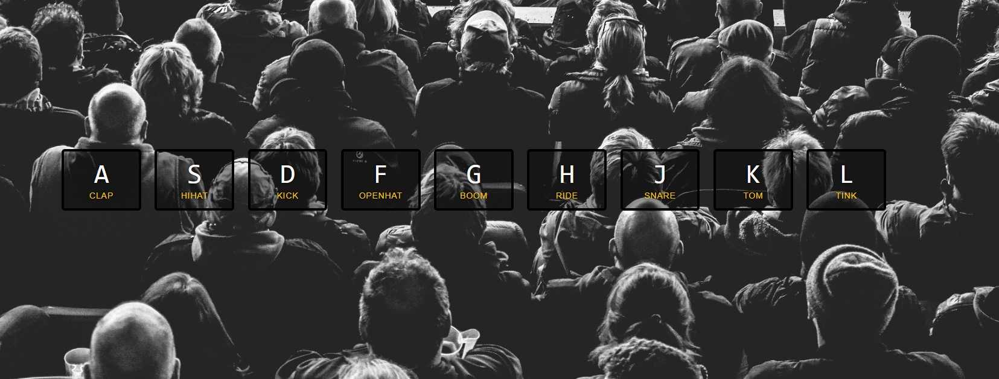

# 01-JavaScript Drum Kit
A responsive list of keys that will play sound and glow when you click on them.

## Noteworthy points:
### Query selector of an element by its attribute:
```javascript
  const audio = document.querySelector(`audio[data-key="${element.code}"]`);
  const key = document.querySelector(`div[data-key="${element.code}"]`);
  ```
 ### Don't wait for an audio to end:
 ```javascript
  audio.currentTime = 0; // rewind to the start
  audio.play();
  ```
  ### Add listeners to a list of elements to check the state of their transition:
  ```javascript
  keys.forEach((key) => {
  key.addEventListener("transitionend", removeTransition);
});
```
