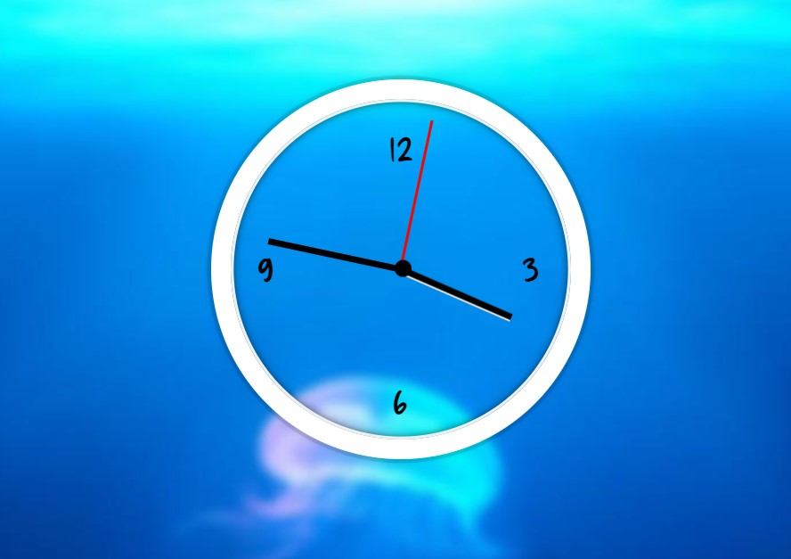

# 02-CSS+JS Clock

A clock that displays your local time

---

### Preview:

<p align="center">
    </img>
</p>

## Noteworthy points:

### Set hour hand to move closer to next hour according to minutes span:

```javascript
function rotateHours(date) {
  const hours = date.getHours();
  const hoursDegrees = (hours / 12) * 360 + (date.getMinutes() / 60) * 30 + 90;
  hoursHand.style.transform = setRotate(hoursDegrees, hoursHand);
}
```

### Remove transition bug when hand rotates to 90deg:

```javascript
function setRotate(deg, pointer) {
  if (deg === 90) {
    pointer.style.transition = "all 0s";
  } else {
    pointer.style.transition = "all 0.05s cubic-bezier(0.1, 2.7, 0.58, 1)";
  }
  return `rotate(${deg}deg)`;
}
```

### Set function to repeat after some time (in ms):

```javascript
setInterval(setDate, 1000);
```
