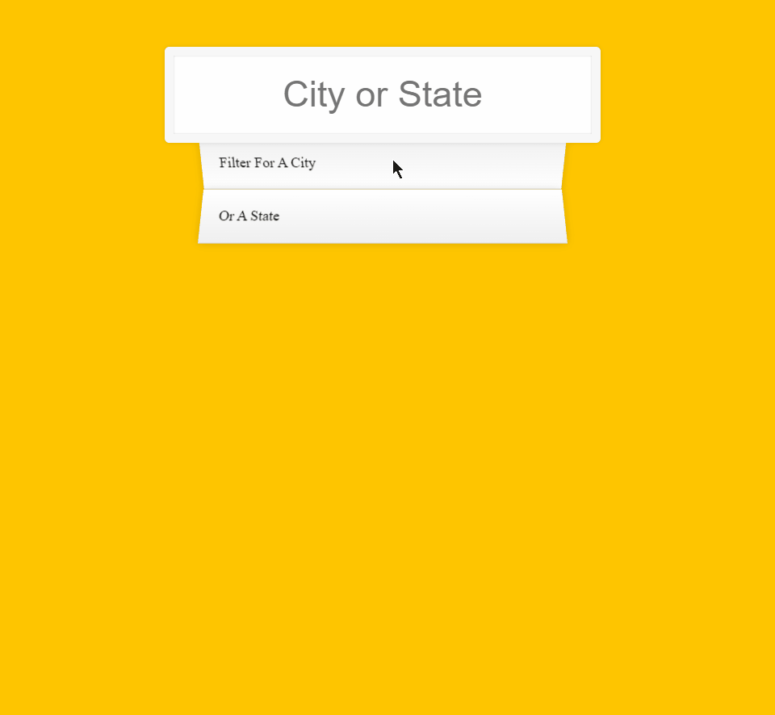

# 06-Type-Ahead

A search form that displays and highlights the cities you search.

---

### Preview:

<p align="center">
    </img>
</p>

## Noteworthy points:

### Fetch a JSON data and spread it into an array:

```javascript
const cities = [];

fetch(endpoint)
  .then((blob) => blob.json())
  .then((data) => cities.push(...data));
```

### Make a regEx from an input value and check if they match:

```javascript
const regEx = new RegExp(wordToMatch, "gi");
return place.city.match(regEx) || place.state.match(regEx);
```

### Highlight input text:

```javascript
const html = matchArray
  .map((place) => {
    const regEx = new RegExp(this.value, "gi");
    const cityName = place.city.replace(
      regEx,
      `<span class="hl">${this.value}</span>`
    ); // highlight input text if matches
    const stateName = place.state.replace(
      regEx,
      `<span class="hl">${this.value}</span>`
    ); // highlight input text if matches
    return `
    <li>
    <span class="name">${cityName}, ${stateName}</span>
    <span class="population">${numbersWithCommas(place.population)}</span>
    </li>`;
  })
  .join(""); // remove commas between arrays
```

### Add commas within population numbers:

```javascript
function numbersWithCommas(x) {
  return x.toString().replace(/\B(?=(\d{3})+(?!\d))/g, ",");
}
```
