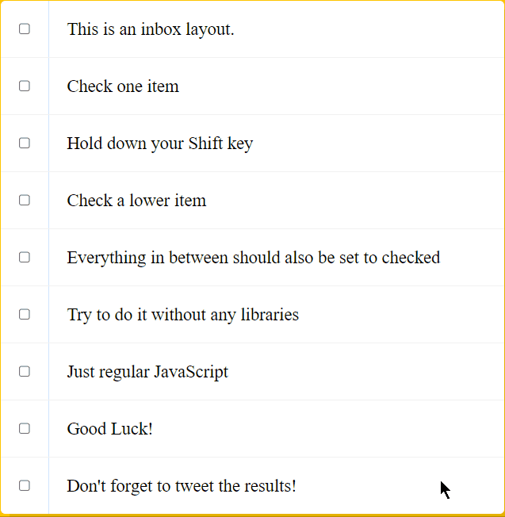

# 10-Hold-Shift-and-Check-Checkboxes

Check checkboxes in between via Shift key

---

### Preview:

<p align="center">
    </img>
</p>

## Noteworthy points:

### Main logic:

```javascript
function handleCheck(e) {
  // Check if they had the shift key down
  // AND check that they are checking it
  let inBetween = false;
  if (e.shiftKey && this.checked) {
    cBoxes.forEach((checkbox) => {
      if (checkbox === this || checkbox === lastChecked) {
        inBetween = !inBetween;
      }
      if (inBetween) {
        checkbox.checked = true;
      }
    });
  }
  lastChecked = this;
}
```
