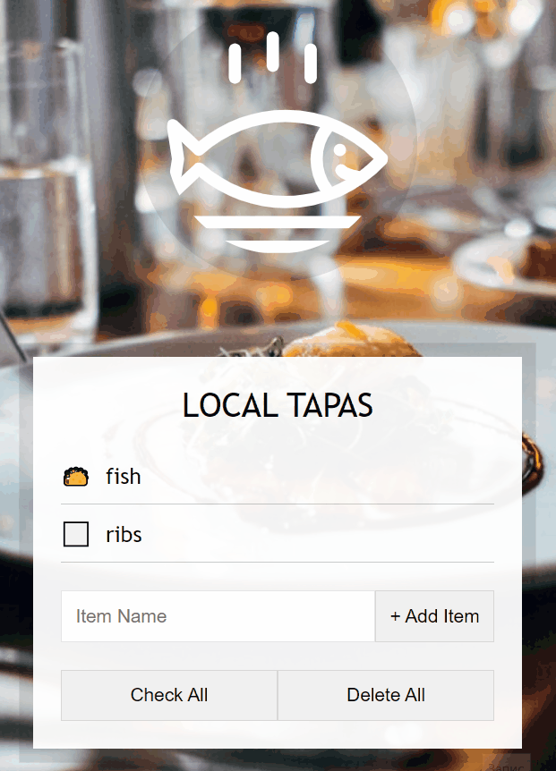

# 15-Local-Storage

Store some data locally to be displayed even if the page was refreshed

---

### Preview:

<p align="center">
    </img>
</p>

## Noteworthy points:

### Remove default checkbox icon and replace it woith a custom one:

```css
.plates input {
  display: none;
}

.plates input + label:before {
  content: "⬜";
  margin-right: 10px;
}

.plates input:checked + label::before {
  content: "🌮";
}
```

### Retrieve an item from localStorage or get a default value if the storage is empty:

```javascript
const items = JSON.parse(localStorage.getItem("items")) || [];
```

### Create a new list item from an object and make sure whether it checked or not. Parse it into a String via _join("")_ so it is displayed correctly as a one big String in your `<ul>`:

```javascript
function populateList(plates = [], platesList) {
  platesList.innerHTML = plates
    .map((plate, i) => {
      return `
        <li>
            <input type="checkbox" data-index=${i} id="item${i}" ${
        plate.done ? "checked" : ""
      }/>
            <label for="item${i}">${plate.text}</label>
        </li>
        `;
    })
    .join("");
}
```

### Save the array of objects in a String format so it can be stored in the localStorage:

```javascript
function updateLocalStorage() {
  localStorage.setItem("items", JSON.stringify(items));
  populateList(items, itemsList);
}
```
