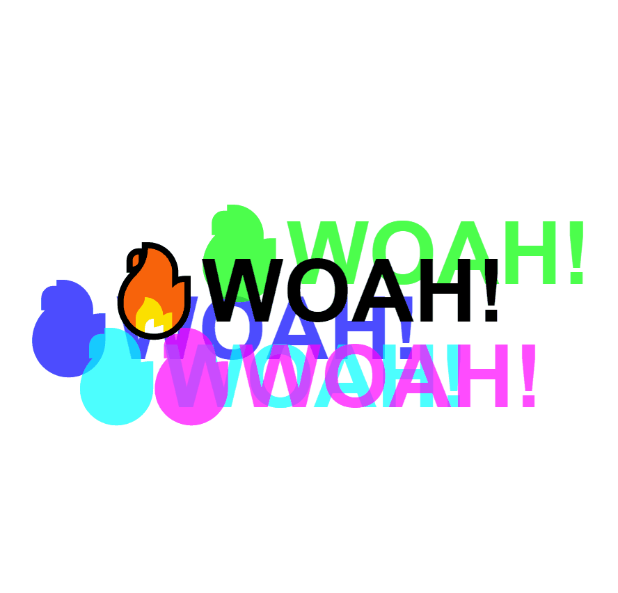

# 16-Mouse-Move-Shadow

Change text shadow according to mouse moves

---

### Preview:

<p align="center">
    </img>
</p>

## Noteworthy points:

### If the cursor goes through the target children, offset listener resets and listens to the children's offsets. To prevent this we can add children's offsets to the parent's ones:

```javascript
const { offsetWidth: width, offsetHeight: height } = hero;
let { offsetX: x, offsetY: y } = event;

if (this !== event.target) {
  x = x + event.target.offsetLeft;
  y = y + event.target.offsetTop;
}
```

### Add a "walk" to know when the shadow should stop growing:

```javascript
const walk = 200; // 200px. Max is 100 and min is -100.

const xWalk = Math.round((x / width) * walk - walk / 2);
const yWalk = Math.round((y / height) * walk - walk / 2);
```
