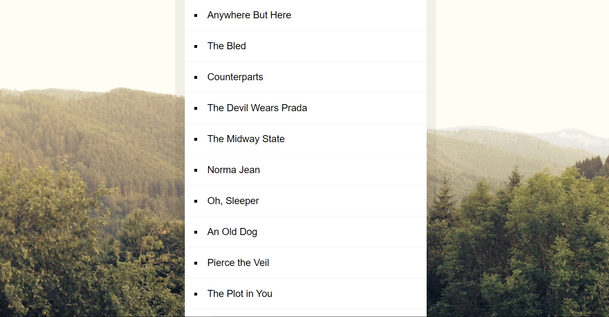

# 17-Sort-Without-Articles

A showcase of sort() and replace() usage to sort an array while omitting articles

---

## Preview:

<p align="center">
    </img>
</p>

## Noteworthy points:

### My first solution:

```javascript
const bands = [
  "The Plot in You",
  "The Devil Wears Prada",
  "Pierce the Veil",
  "Norma Jean",
  "The Bled",
  "Say Anything",
  "The Midway State",
  "We Came as Romans",
  "Counterparts",
  "Oh, Sleeper",
  "A Skylit Drive",
  "Anywhere But Here",
  "An Old Dog",
];

const list = document.querySelector("#bands");

let sorted = bands.sort((a, b) => {
  let cutA = omitArticle(a);
  let cutB = omitArticle(b);

  return cutA > cutB ? 1 : -1;
});

sorted.forEach((band) => {
  list.innerHTML += `<li>${band}</li>`;
});

function omitArticle(band) {
  if (band.startsWith("A ")) {
    return band.substring(2);
  } else if (band.startsWith("An ")) {
    return band.substring(3);
  } else if (band.startsWith("The ")) {
    return band.substring(4);
  } else return band;
}
```

### My 2nd solution with replace():

```javascript
const list = document.querySelector("#bands");
const articles = /^(A |An |The )/gim;

let sorted = bands.sort((a, b) => {
  let cutA = omitArticle(a);
  let cutB = omitArticle(b);

  return cutA > cutB ? 1 : -1;
});

sorted.forEach((band) => {
  list.innerHTML += `<li>${band}</li>`;
});

function omitArticle(band) {
  return articles.test(band) ? band.replace(articles, "") : band;
}
```

### Challenge solution :

```javascript
const sortedBands = bands.sort((a, b) => (strip(a) > strip(b) ? 1 : -1));

document.querySelector("#bands").innerHTML = sortedBands
  .map((band) => `<li>${band}</li>`)
  .join("");

function strip(bandName) {
  return bandName.replace(/^(a |an |the )/gim, "").trim();
}
```
