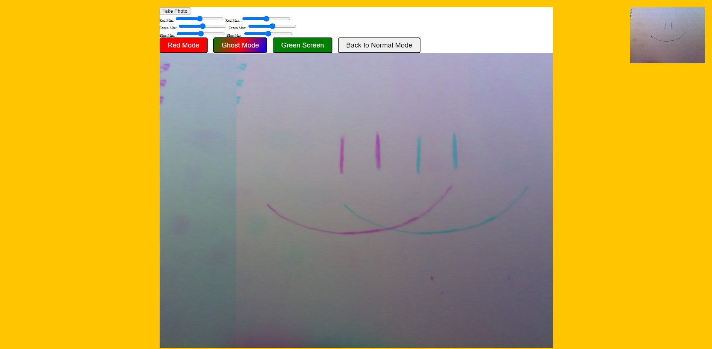

# 19-Webcam-Fun

Project your webcam image on a canvas and mess with RGBs

---

## Preview:

<p align="center">
    </img>
</p>

## Noteworthy points:

### video.srcObject is a modern way to get media stream data:

```javascript
function getVideo() {
  navigator.mediaDevices
    .getUserMedia({ video: true, audio: false })
    .then((localMediaStream) => {
      video.srcObject = localMediaStream;
      video.play();
    })
    .catch((err) => {
      console.error("OH NOO!!!", err);
    });
}
```

### It replaces an obsolete way of doing this:

```javascript
video.src = window.URL.createObjectUrl(localMediaStream);
```

### Get video's aspect ratio and apply it to the canvas:

```javascript
const width = video.videoWidth;
const height = video.videoHeight;
canvas.width = width;
canvas.height = height;
```

### Redraw the canvas every 16ms and apply the needed mode :

```javascript
function paintToCanvas(moddedPixels) {
  const width = video.videoWidth;
  const height = video.videoHeight;
  canvas.width = width;
  canvas.height = height;

  interval = setInterval(() => {
    ctx.drawImage(video, 0, 0);
    // Take the pixels out:
    let pixels = ctx.getImageData(0, 0, width, height);
    // Mess with them:
    if (typeof moddedPixels === "function") {
      if (moddedPixels.name === "rgbSplit") {
        ctx.globalAlpha = 0.1;
      }
      pixels = moddedPixels(pixels);
    }
    // Put them back:
    ctx.putImageData(pixels, 0, 0);
  }, 16);

  return interval;
}
```

### Paint the video on the canvas when it is ready to be displayed:

```javascript
video.addEventListener("canplay", paintToCanvas);
```
