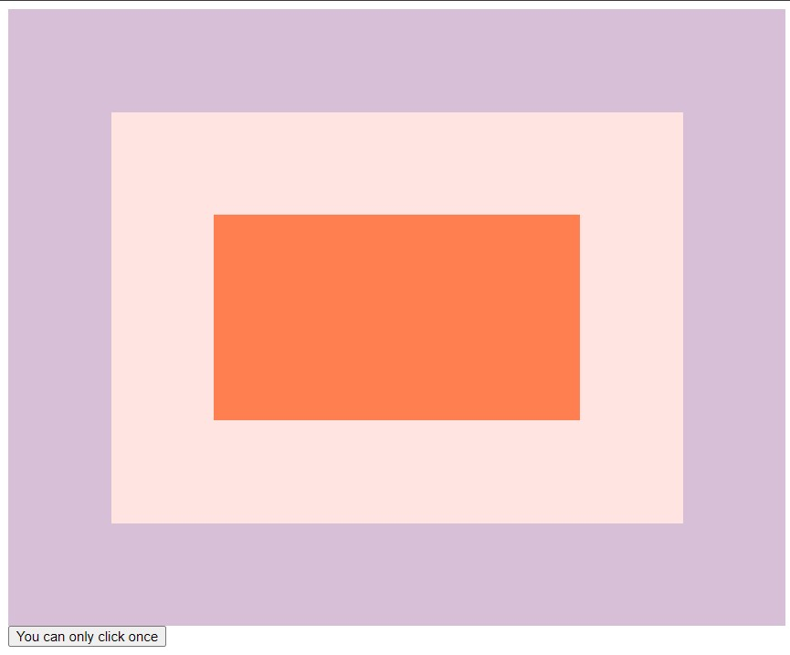

# 25-Event Capture, Propagation, Bubbling and Once

A demonstration of usage of propagation, bubbling and once.

---

### Preview:



## Noteworthy points:

### Run listeners from down to up:

```javascript
divs.forEach((div) => {
  div.addEventListener("click", logText);
});
```

OR change it from up to down:

```javascript
divs.forEach((div) => {
  div.addEventListener("click", logText, {
    capture: true,
  });
});
```

### Prevent from triggering element's parents:

```javascript
function logText(e) {
  console.log(this.classList.value);
  e.stopPropagation(); // stop bubbling
}
```

### Remove event listener after clicking it once:

```javascript
button.addEventListener(
  "click",
  () => {
    console.log(`Click!`);
  },
  { once: true }
);
```
